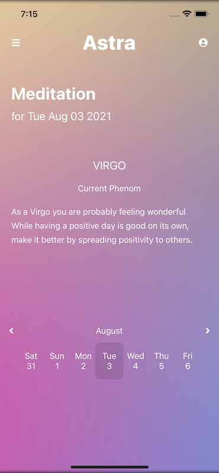
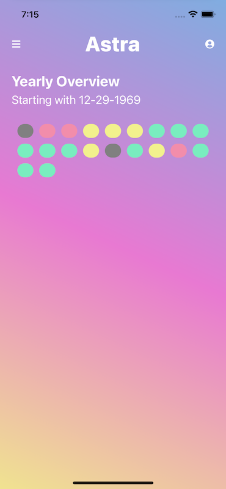

# Astra

> A mobile application that gives users daily meditations based on their zodiac sign.

## General Information

This project was completed while interning at Breach Software and was a collaborative effort of all of the current interns.

## Technologies Used

-   React Native - version 0.64.2
-   Chakra UI - version 1.6.0
-   Firebase - version 8.8.1

## Screenshots

Initial Screen


Home Screen


Profile


Overview


## Setup

To run this project, install it locally using yarn or npm

yarn

```
$ cd ../progress-tracker
$ yarn
$ yarn start
$ cd ios
$ cd ..
$ npx react-native run-ios
```

npm

```
$ cd ../progress-tracker
$ npm install
$ npm start
$ cd ios
$ cd ..
$ npx react-native run-ios
```

## Features

-  Custom meditation based on users zodiac sign
-  Interactive calendar that allows you to view past mediatations
-  Overview that displays progression of the users mood over time
-  Profile page

## Contact

Created by [Dani Tyler](https://www.dani-tyler.com)
